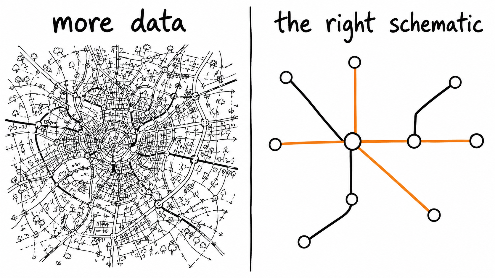

The energy transition is an urgent problem. We can also call it a materials problem: Most likely, breakthrough materials would unlock breakthroughs in the energy transition. So we need to find those materials, and we need to find them fast. 

The good news is that many are trying to do so. Many attempts try to use so-called "AI scientists" to accelerate the search. In these systems (agents) an LLM can orchestrate different tools but also perform some of its own reasoning. Coupling them to robots, one can generate a lot of data. 

Agents help a lot. They let me run experiments I would never have the time to run on my own. They help me think deeper, acting as a somewhat intelligent rubber duck. They even help me iterate through many different versions of a possible paper until I land on the strongest one. I am not arguing against any of this — it is genuinely useful, and I use it every day.

But just scaling up the number of datapoints will not get us where we need to go. At least it does not seem to be the right path to the breakthroughs we need. 

We cannot keep building bigger and bigger maps of chemical space, Borges-style. In *On Exactitude in Science*, Jorge Luis Borges imagines an empire whose cartographers draw a map so detailed it is the exact size of the empire itself — perfect, and completely useless. More detail is not the same thing as more understanding. At some point you have to make sense of the map: to coarse-grain it down to something a human can actually hold in their head.

{#fig-schematic}

And this matters for a concrete reason: coarse-graining is what makes search effective.

People throw around numbers like $10^{60}$ compounds. But even if we are humble and say we will only ever consider $10^{20}$, the arithmetic is brutal. If a single screening step takes one second, getting through all of them takes about 3.17 trillion years. And if it costs around twenty cents per candidate — roughly our current cost per paper in the [PERLA pipeline](https://fairmat-nfdi.github.io/perla/) — you are looking at roughly €$2 \times 10^{19}$ to brute-force your way through.

Of course, you could argue that we do not have to be that dumb about it. We could use Bayesian optimization or similar techniques to be clever about how we explore chemical space, and never touch most of those candidates. That is true. But to make the big leaps — and the big cuts — you still need heuristics and understanding. Clever local search inside the wrong frame just gets you efficiently to the wrong place.

This is the real risk. Scale and robots alone give you what [Alvin Djajadikerta has called *hypernormal science*](https://www.asimov.press/p/ai-science?hide_intro_popup=true): a more and more detailed map of what you already believe. The energy transition does not need a more detailed map. It needs the right schematic — and that only comes from work aimed at understanding, not prediction.

And, isn't understanding the point of (fundamental) science in the first place? 
To make real breakthroughs with "AI Scientists" we need to find ways to not just be faster, larger, greater - but also able to have what my PhD advisor called the "helicopter move": Zoom in for the details and zoom out for the patterns.
