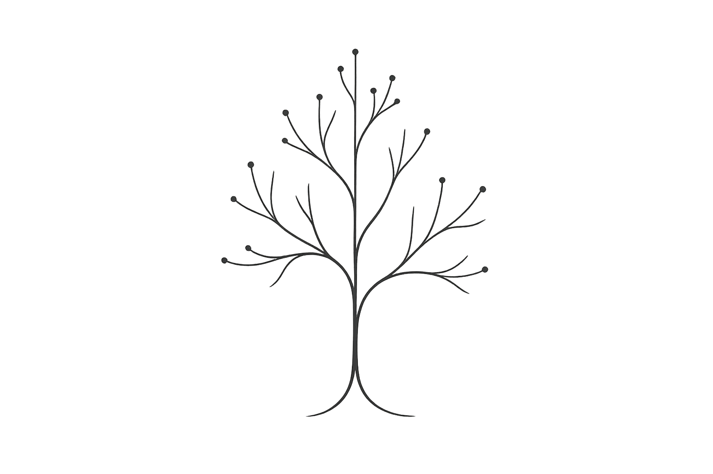

In today's literature seminar, the participants noticed that I perhaps have grown cynical. 
On most papers presented, I scribble the same verdict: not impactful. My perception—perhaps wrong, perhaps not—is that the fraction of impactful research is shrinking. Not because we've stopped producing good work, but because it is drowned in an avalanche of papers screaming for attention.

I am part of the problem. I cannot call most of my research truly impactful. A small subset may be important if I'm generous.

It is hard not to be part of the problem. PhD students must graduate, preferably with cumulative theses that meet minimum paper requirements. The old-fashioned monograph still exists, but it's a hard sell when paper counts determine everything: tenure decisions, grant reviews, a graduate's prospects on the job market.[Academia has the additional challenge that it is an [educational institution](https://www.sam-rodriques.com/post/academia-is-an-educational-institution)]{.aside} In industry, different pressures apply—internal funding mechanisms, research as PR, research as recruitment. The result is the same.

We assemble talented people. We invest public money. We do not advance research optimally. The opportunity cost is real. That funding could have expanded healthcare coverage, supported developing nations, and accelerated renewable energy. Instead, we feed the paper mill.

Students, confronted with this tension, asked me how to identify impactful work. Borrowing from Kierkegaard, I can only say "Research can only be understood backwards; but must be executed forwards." Some kinds of impact are only “obvious” in hindsight. 

Still, some heuristics exist. In my field, research proves impactful by providing a tool that others use, by opening a new perspective, or by crystallizing evidence that had been merely anecdotal.

Think of research as a tree of ideas. Three paths to impact emerge:

First, take a branch and plant a new tree. This grows into a product or tool that supports novel growth elsewhere.

Second, grow one branch deeper, enabling its transition into something usable.

Third, grow a new branch entirely.

You can identify the first by checking for a usable tool. If nothing exists that I can use, it cannot support new growth.

You can identify the second by counting the hypotheses explored and ablation studies conducted. The branch grows deeper and deeper.

You can identify the third by its complete novelty—not applying an existing technique to a new system, not adding one twist to extend a branch slightly, but doing something without precedent.

What does this mean for leading a research group? I want to push harder for our work to fall into one of these categories. If something can start as its own tree, give it everything: documentation, user support, tests, and community building.

If something can go deep, let it go deep. So deep that the next work can cut this branch—either to discard it or to plant a new tree.

If something is novel, go broad. Explore how far the novelty extends.

I worry about my career and my students' careers. But I also think about the research money I manage. It could have funded some other public good. In a leadership seminar, I learned that "Leadership operates in areas of tension that cannot be resolved but can be balanced." The tension in research is real. So is our failure to balance it.