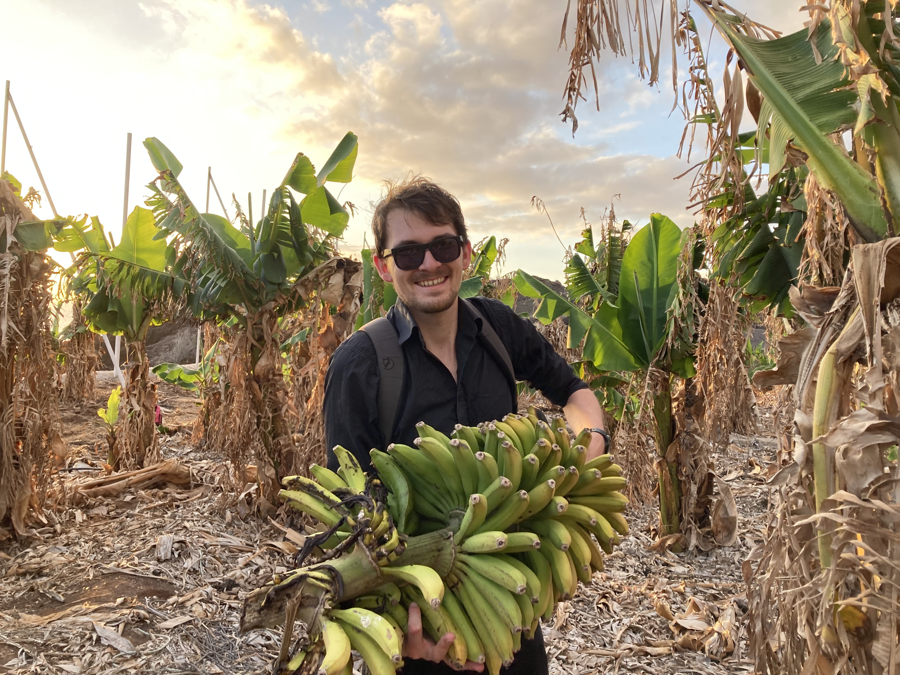

::: {layout="[30,70]" .profile-header}

{.profile-pic}

I lead [LAMALab](https://lamalab.org/) at Friedrich Schiller University Jena.
We develop AI as a scientific instrument: making chemical concepts measurable and turning raw observations into experiments. 
[Bio, research programme, and CV](bio.qmd)

:::

::: {.callout appearance="simple"}
Check out the lab website [lamalab.org](https://lamalab.org/) -- we're hiring!
:::

## Contact

[email](https://mailhide.io/e/o4LeOUlq) | [LinkedIn](https://www.linkedin.com/in/kevin-maik-jablonka-538655200/) | [Bluesky](https://bsky.app/profile/kjablonka.com)  | [Google Scholar](https://scholar.google.com/citations?user=R2ntI8IAAAAJ&hl=en) | [Bio & Photos](bio.qmd) | [Feedback](https://www.admonymous.co/kjappelbaum)

## Notes

A collection of unfinished thoughts and ideas.

::: {#blog-listings}
:::
