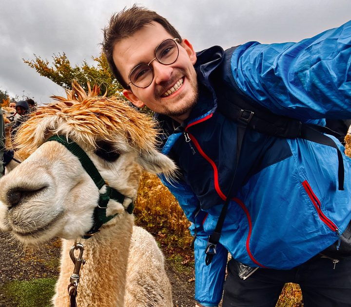

::: {layout="[28,72]" .profile-header}

{.profile-pic}

I lead [LAMALab](https://lamalab.org/) at Friedrich Schiller University Jena. We develop AI as a scientific instrument: making chemical concepts measurable, and turning raw observations into the next experiment.

[Research](research.qmd) · [Bio](bio.qmd) · [Email](https://mailhide.io/e/o4LeOUlq) · [Scholar](https://scholar.google.com/citations?user=R2ntI8IAAAAJ&hl=en) · [Bluesky](https://bsky.app/profile/kjablonka.com)

The lab is [hiring](https://lamalab.org/).

:::

## Notes

::: {#blog-listings}
:::

---

[Consulting, mentoring, the error bounty, and how this site is made](colophon.qmd) · [RSS](index.xml)
